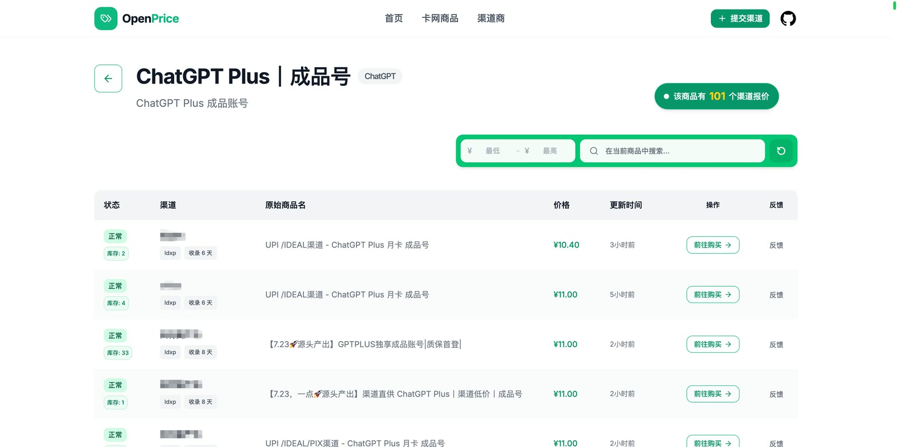

# OpenPrice - AI 订阅价格聚合与卡网渠道比价平台
OpenPrice 是一个开源的 AI 订阅价格聚合与比价平台，专注于收录和比较不同平台、国家地区以及卡网渠道的 AI 产品价格。

项目汇集 ChatGPT、Claude、Gemini、Grok、Cursor 等产品的官方订阅价格与卡网渠道报价，帮助用户快速进行价格查询、多渠道比价，并比较不同渠道的 AI 套餐差异、价格差异，找到更适合自己的选择。

OpenPrice 仅提供公开价格信息的整理、聚合与比价展示，不销售任何商品，也不参与用户与卡网渠道之间的交易。

### 汇聚全网海量渠道底价


---

## 快速访问 (Quick Links)

**买家入口：**
- [**查看全网 AI 订阅 各个渠道的最新底价**](https://www.openprice.cc/card-products)
- [**对比 ChatGPT、Claude、Grok 在 app store不同地区的官方订阅价格**](https://www.openprice.cc/official-prices)

**渠道商必看：**
- [**卡网商家一键免费收录**](https://www.openprice.cc/)
- [**如何被正确收录？(渠道商接入指南)**](https://www.openprice.cc/guide/getting-started)
- [**如何更好的展示商品？(渠道商最佳实践)**](https://www.openprice.cc/guide/best-practices)

**开发者及其他：**
- [**快速开始部署指南**](#-快速开始-getting-started)
- [**免责声明**](#️-免责声明-disclaimer)

## 技术交流与分享
<div align="center">
  <a href="https://t.me/openprice1" target="_blank">
    
  </a>
  <a href="https://qm.qq.com/q/2FdPYLVYjC" target="_blank">
    
  </a>
  <a href="https://www.v2ex.com/t/1229919" target="_blank">
    
  </a>
  <a href="https://www.nodeseek.com/post-836071-1" target="_blank">
    
  </a>
</div>

<br/>

## 项目初衷与解决的痛点

如今大家对 AI 订阅如 Claude、chatgpt 有着很大的需求，虽然市面上有着非常多高性价比的产品，但它们往往分散在各个不同的渠道中，例如**链动小铺、独角卡网、二次元发卡、微信群、QQ群、闲鱼、淘宝**等。这种信息不对称导致了两个主要问题：
1. **对于买家（普通用户）**：很难找到靠谱、便宜的购买渠道，往往需要花费很多时间找渠道，甚至容易买贵。
2. **对于卖家（渠道商）**：手里有优质、低价的渠道产品，却苦于没有集中曝光的流量池，价格最低但是很难卖出去。

**OpenPrice 致力于解决这些问题，它是一个完全免费的开源平台，适合以下人群：**

* **适合买家**：平台汇聚了全网绝大部分的卡网ai产品价格数据。无论是**代充、成品号、日抛、rt、at、带质保**等形式的 AI 产品（如 **Claude, GPT, Codex, Gemini** 等），还是非 AI 类的数字产品（如**接码、住宅代理、TG账号、谷歌账号**等），渠道价格在这里**一览无余**。你能轻松对比全网价格，打破信息差，以**最低价**购买到最适合自己的产品。👉 [**点击这里查看全网 AI 订阅最新底价**](https://www.openprice.cc/card-products)
* **适合卡网商家/渠道商**：支持商家**一键免费提交**自己的卡网渠道。无需复杂的推广，即可获得曝光，方便地向全网用户展示和推销自己的优质产品。👉 [**点击这里快速免费收录您的渠道**](https://www.openprice.cc/)

## 核心特性 (Features)

* **全网价格透明化**: 实时聚合各卡网（如链动小铺、独角卡网等）渠道产品价格，最低价及质保服务一目了然。
* **官方订阅价格对比**: 展示 ChatGPT、Claude、Grok 等热门 AI 应用的 App Store 不同地区的官方订阅价格，可按套餐查看不同国家和地区的完整价格排行。
* **AI 及数字产品深度定制**: 针对市面上热门的 AI 产品（Claude, GPT 等的代充、成品号、日抛）以及接码、住宅代理等服务，进行深度的数据分类与智能匹配。
* **商家一键入驻**: 目前已无缝支持市面主流发卡系统（如**链动小铺、独角数卡、二次元发卡**等）的**免开发一键接入**。同时，对于**自建商城/非标系统**，平台也已发布了标准化的 **[JSON-LD 接入规范](https://www.openprice.cc/guide/getting-started)**，只需简单优化代码，即可被精准收录，轻松获取海量免费流量。
* **极致的用户体验**: 告别繁杂的信息堆砌，提供直观、清爽的产品聚合展示，流畅地检索、对比和挑选心仪的商品，享受极速、顺滑的购物决策体验。

卡网渠道与官方订阅在购买来源、账号归属、售后方式和风险方面并不相同。第一次使用前建议阅读 [官方订阅与卡网渠道有什么区别？](https://www.openprice.cc/guide/official-vs-card-products)。

## 技术栈 (Tech Stack)

* **前端**: Next.js 14 (React 18), Tailwind CSS, Material UI, Framer Motion
* **后端/数据库**: Supabase (PostgreSQL, Authentication)
* **抓取/引擎**: 基于 Python 的爬虫工具与规则分类引擎

## 快速开始 (Getting Started)

### 环境要求

* Node.js (推荐 v18 或以上)
* pnpm 或 npm
* Python (推荐 v3.8 或以上，用于运行爬虫与分类引擎)

### 1. 克隆项目与安装依赖

```bash
git clone <your-repo-url>
cd awesome-OpenPrice

# 安装依赖
npm install
# 或者使用 pnpm
pnpm install
```

### 2. 环境配置

复制根目录下的示例环境变量文件，并填入你自己的配置信息：

```bash
cp .env.example .env.local
```

### 3. 数据库初始化

本项目底层使用 **PostgreSQL** 作为核心数据库。
请执行本项目 `supabase/public_schema.sql` 文件中的 SQL 语句，以完成表结构与基础数据的初始化。

### 4. 运行开发环境

```bash
npm run dev
# 或 pnpm dev
```

打开浏览器访问 [http://localhost:3000](http://localhost:3000) 即可查看项目运行效果。


## 贡献

* **提交渠道**: 如果您是卡网商家，欢迎在平台上免费提交您的渠道信息。
* **代码贡献**: 本开源项目欢迎任何形式的代码贡献！如果你发现了 Bug 或者有新功能建议，请提交 Issue 或者 Pull Request。


## 免责声明 (Disclaimer)

**本网站/项目仅提供对全网渠道价格的客观聚合展示，不参与任何实际交易，也不对任何第三方产品的质量提供任何担保。**
本项目只是对第三方渠道做收录，任何人都可以自由提交渠道并被平台收录。平台内展示的具体商品**完全按照价格高低进行客观排序**，绝不存在弄虚作假、暗箱操作或故意更改排序的行为。
用户在进行购买决策时，需自行仔细甄别，并遵循原商品发布平台的规则与质保条款。所有交易风险由买卖双方自行承担。

## 许可证 (License)

本项目采用 **自定义许可协议**。

**允许以下行为：**
* 学习、研究和代码阅读。
* 个人自用和本地部署。
* 内部非商业使用。
* 提交 Issue、Pull Request 和改进建议。

**未经书面授权，不允许：**
* **直接运营或商业化**：将 OpenPrice 或其修改版本作为公开网站、SaaS 平台对外运营，或在项目中接入广告、推广链接（AFF）、付费导流等任何形式的商业变现。
* **竞品化**：利用本项目的代码或核心逻辑，运营与 OpenPrice 定位高度相似的比价、导航、或数据聚合服务。
* **滥用品牌与数据**：使用 OpenPrice 的名称、截图、线上抓取的数据快照或渠道资源用于商业服务。
